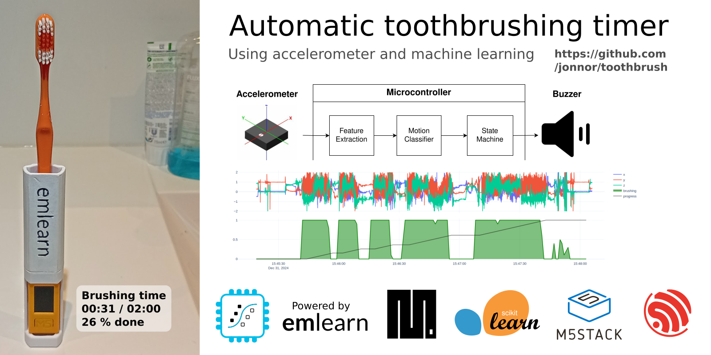
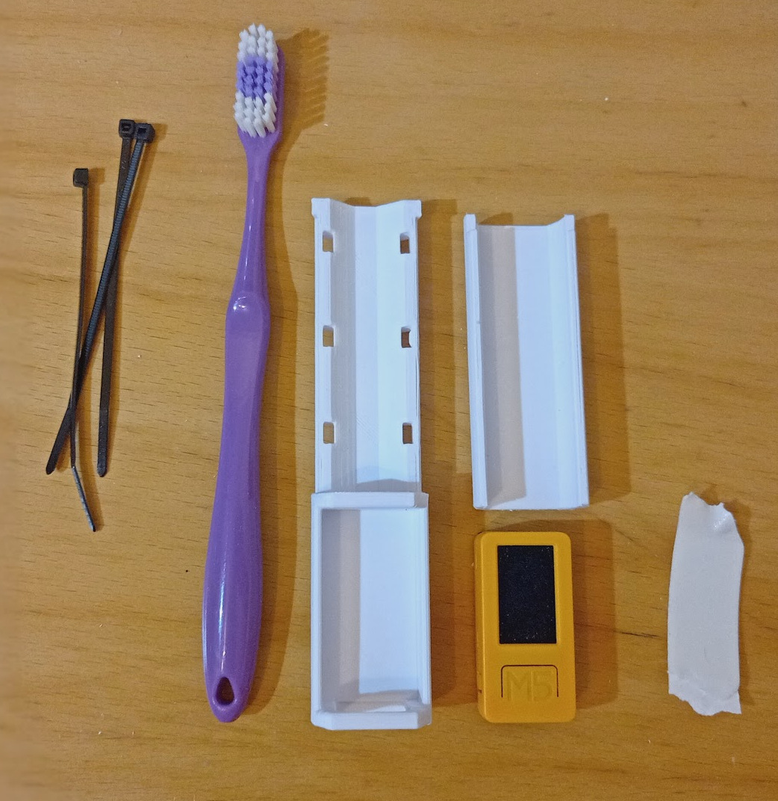
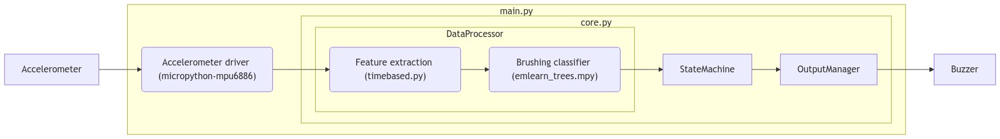
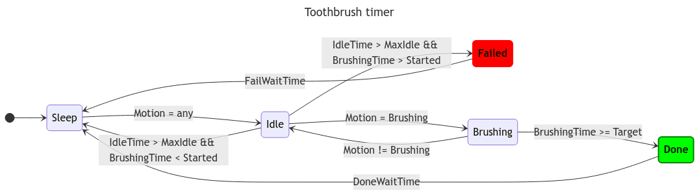

# Automatic toothbrush timer

This toothbrush timer tracks how long you spend on actively brushing your teeth.
It uses an accelerometer to measure motion, and analyzes it using a simple machine learning model.
The device helps you get to the 2 minute mark, which is the recommend duration!

This is a demo project for [emlearn-micropython](https://github.com/emlearn/emlearn-micropython),
a library efficient Machine Learning and Digital Signal Processing for [MicroPython](https://micropython.org/).
The intent is to be a fun but realistic application of machine learning on microcontrollers,
in the area of Human Activity Recognition.



## Status
***Proof of Concept***. Basic functionality tested working on device.

- Firmware is complete and functional
- Documentation in *work in progress*
- Software and training pipeline needs some cleanup

## License
MIT


## Hardware

To assemble the device, one needs the following.

- [M5Stick C PLUS2](https://shop.m5stack.com/products/m5stickc-plus2-esp32-mini-iot-development-kit) from M5Stack
- 3d-printed toothbrush holder. [.STL export](mechanics/toothbrush-handle-print.stl) | [FreeCAD project](mechanics/toothbrush-handle.FCStd)
- Zipties
- Double-sided tape

.

## How it is built

The code that runs on device is found in [firmware/](./firmware).
The code used on PC to train machine learning model is found in [software/](./software)

#### Data recording

To record data we used the `har_record.py` script from [emlearn-micropython har_trees example](). 

#### Firmware

The firmware has the following overall architecture:



Here is the states of the state machine, that defines the overall behavior of the device:



## Installing

#### Development environment

You must have Python 3.10+ installed.
Using a virtual environment is recommended.

Install project dependencies

```
pip install -r requirements.txt
```

#### Flash MicroPython to device

Uses MicroPython 1.24 for ESP32

```
mpflash flash --version 1.24
```

#### Copy dependencies to device

Minimum requirements
```
mpremote mip install https://emlearn.github.io/emlearn-micropython/builds/master/xtensawin_6.3/emlearn_trees.mpy
mpremote mip install github:jonnor/micropython-npyfile
mpremote mip install github:jonnor/micropython-mpu6886
mpremote mip install https://github.com/emlearn/emlearn-micropython/raw/refs/heads/master/examples/har_trees/timebased.py
```

Additional dependencies to use har_record.py for recording data
```
mpremote mip install https://github.com/emlearn/emlearn-micropython/raw/refs/heads/master/examples/har_trees/recorder.py
mpremote mip install https://raw.githubusercontent.com/emlearn/emlearn-micropython/refs/heads/master/examples/har_trees/color_setup.py
mpremote mip install "github:peterhinch/micropython-nano-gui/drivers/st7789"
mpremote mip install "github:peterhinch/micropython-nano-gui"
mpremote mip install "github:peterhinch/micropython-async/v3/primitives"
```

The GUI libraries are not used by the main firmware,
but is used by some of the tools like for data-recording.

#### Copy application to device

```
TODO: document
```


## Developing


#### Running firmware tests on PC

With MicroPython Unix port, one can run the firmware tests on PC.

```
micropython firmware/test_toothbrush.py
```

#### Running firmware tests on device

```
TODO: check tests on device, document how to run
```
